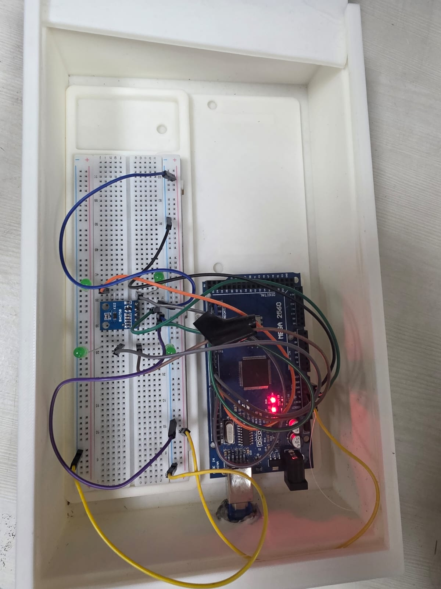

# EE 390 Design Lab — IIT Guwahati

<p align="center">
  
</p>

<p align="center">
  <strong>Secure Light-Intensity Control using LWE-based Homomorphic Encryption</strong><br/>
  Design Lab project under <strong>Professor Prithwijit Guha</strong>, IIT Guwahati
</p>

---

## Overview

This project demonstrates a practical embedded control pipeline where light sensing and PWM control are integrated with LWE-based cryptographic operations.  
The system reads ambient lux values using a BH1750 sensor, performs encrypted control-side computation, and applies controlled LED output via Arduino.

## Project Highlights

- Built a closed-loop light control setup with BH1750 sensing and PWM LED actuation.
- Integrated Learning With Errors (LWE) key generation and encrypted data exchange.
- Implemented host-assisted encrypted proportional control flow over serial communication.
- Added optimized modular arithmetic and lightweight parsing for microcontroller feasibility.
- Evaluated system behavior and documented results in a formal project report.

## Repository Structure

```text
.
├── bh1750_lwe_encrypt/
│   ├── bh1750_lwe_encrypt.ino
│   ├── lwe_public_key.h
│   ├── lwe_private_key.h
│   ├── lwe_public_key.json
│   └── lwe_secret_key.json
├── PID_encrypt.py
├── keygen.py
├── gen_private_header.py
├── mondalf.ino
├── mondalf.py
├── Homomorphic LWE Encryption Report.pdf
└── Work_Bench.jpeg
```

## Report

📄 **Full Report:** [Homomorphic LWE Encryption Report.pdf](./Homomorphic%20LWE%20Encryption%20Report.pdf)

### Brief Summary (from the report)

- Formulated an LWE-based encryption workflow suitable for embedded control communication.
- Designed encrypted lux message transmission between Arduino and host processor.
- Computed encrypted proportional-error terms and returned encrypted PWM-compatible outputs.
- Demonstrated reliable light regulation while preserving confidentiality of control-relevant values.
- Discussed implementation trade-offs between security overhead and real-time responsiveness.

## Tech Stack

- **Embedded:** Arduino (C/C++)
- **Sensor Interface:** I2C + BH1750
- **Host Control Scripts:** Python
- **Crypto Concept:** LWE-based homomorphic-compatible operations

## Acknowledgement

This work was completed as part of the **EE 390 Design Lab** at **IIT Guwahati**, under the guidance of **Professor Prithwijit Guha**.
